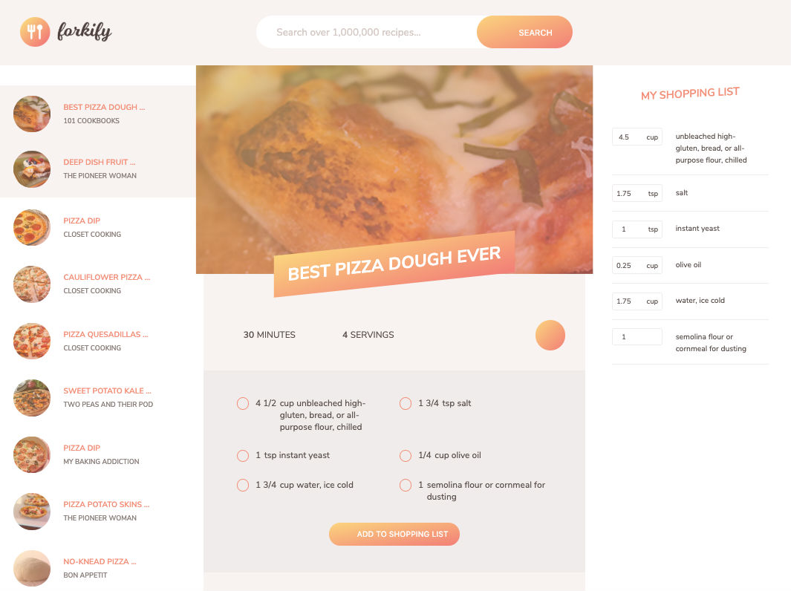

# Food recipe search - practice project

## Forkify

Forkify is an application designed for food enthusiasts. This application is build with Html5, Css3, Java Script, Webpack and Babel6. It allows the use:

- User will get a list of recipies according to the keyword search
- User can check the selected recipe's list of ingredients and serving
- Add the servings to the shopping list by clicking on the "Add to shopping list" button
- Favorite a specific recipe by clicking on the heart in the middle
- Consult the list of favorite recipes (stored in the browser's localStorage) by clicking on the heart in the top right corner
- User will get directions on how to cook the recipe 

## Screenshot



## Directions to use and install this application

Step 1. Download or clone project 
```
https://github.com/kplakosh/forkify.git
```

Step 2. Register an account on the website <a href="https://www.food2fork.com/">https://www.food2fork.com/</a>.

Step 3. Get your api key here <a href="https://cors-anywhere.herokuapp.com/">https://cors-anywhere.herokuapp.com/</a>.

Step 4. In the config.js file add your api key.

Step 5. In console run webpack command in development mode:
```
$ npm run dev
```

Step 6. In console run webpack in production mode:
```
$ npm run build
```

Step 7. Start webpack server using command:
```
$ npm run start
```

## Original author (instructor)

<a href="https://twitter.com/jonasschmedtman">Jonas Schmedtmann</a>

## Powered by

<a href="https://www.food2fork.com/">https://www.food2fork.com/</a>

## License

MIT